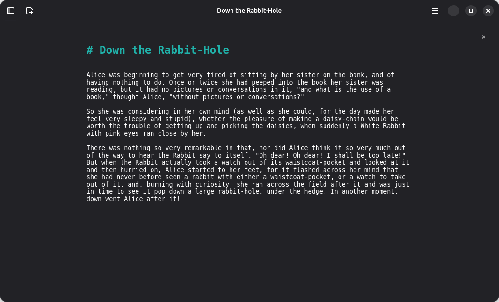

[](https://github.com/sevonj/scratchmark/actions/workflows/ci.yml)

# Scratchmark


Scratchmark is a markdown editor designed both for keeping notes and writing. It's intended to become a spiritual successor to [ThiefMD](https://github.com/kmwallio/ThiefMD/).





## Developers

Scratchmark is written in Rust and uses GTK4 + Libadwaita for UI.

[➜ Project management](https://github.com/users/sevonj/projects/20)

### License

Scratchmark is licensed GPL-3.0-or-later. Some parts may *additionally* be available under other licenses, such as MIT.

### Building

When running from the source directory, there's an additional step to the usual `cargo run` command. You need to set this env var:

```sh
# In repository root
export GSETTINGS_SCHEMA_DIR=$PWD/data
```

The app needs its settings schema, and the lookup path seemingly can't be set in the program itself.

### Continuous Integration

Pull requests are gatekept by [this workflow.](https://github.com/sevonj/scratchmark/blob/master/.github/workflows/rust.yml) It will check if the code

- builds
- passes unit tests (run `cargo test`)
- has linter warnings (run `cargo clippy`)
- is formatted (run `cargo fmt`)

### Dependencies

Ubuntu

```
libgtk-4-dev build-essential libglib2.0-dev libadwaita-1-dev libgtksourceview-5-dev
```

### Flatpak

#### Dependencies

You need Python3 with the following packages: 

```
aiohttp toml
```

You need Flatpak w/ Flathub and the following packages:

```
org.gnome.Sdk//48
```

#### Building

Build & install:

```sh
cd build-aux
sh generate_flatpak.sh && sudo flatpak install -y Scratchmark.flatpak
```
`generate_flatpak.sh` will download and run a python script from Flatpak's builder tools repository.
