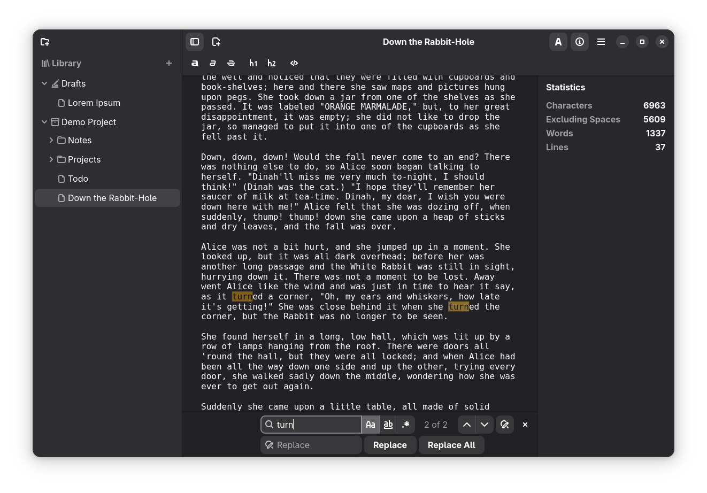

[](https://github.com/sevonj/scratchmark/actions/workflows/ci.yml)
[](https://translate.codeberg.org/projects/scratchmark/app)

<div align="center">


# Scratchmark

https://scratchmark.org

</div>

**\*\*Scratchmark\*\*** is a pleasant Markdown editor for writing. It tries to give you everything you need and otherwise stay out of your way so you can just focus on writing. The app can be used for writing essays and making quick notes alike. Its file management is built around a folder structure that can handle large projects with lots of files. You can add any folder on your computer to the library, and move files around by dragging and dropping.

Scratchmark is intended to become a spiritual successor to [ThiefMD](https://github.com/kmwallio/ThiefMD/).





## Get Scratchmark

### Linux

<a href='https://flathub.org/apps/org.scratchmark.Scratchmark'>

</a>

### Windows

(planned)

## Contribute

<div align="center">

<p style="font-size: 3em; font-variant-caps: small-caps;">i want <b>you</b></p>
<p style="font-size: 3em;">🫵</p>
<p style="font-size: 2em; font-variant-caps: small-caps;">to contribute</p>
<p>Enlist now!</p>

</div>

[➜ Translation](https://translate.codeberg.org/projects/scratchmark/app/)  
[➜ Project Backlog](https://github.com/users/sevonj/projects/20)

If you find an issue that's important to you, give it a thumbs up.

## Developers

Scratchmark is written in Rust and uses GTK4 and Libadwaita for UI.

### License

Scratchmark is licensed GPL-3.0-or-later. Some parts may _additionally_ be available under other licenses, such as MIT.

### Building

The project is transitioning to Meson build system, but it remains possible to build and run it with Cargo.

### Cargo

When running from the repository, there's an additional step to the usual `cargo run` command. You need to set an env var to tell the app where to find it:

```sh
export GSETTINGS_SCHEMA_DIR=$PWD/data
```

The app needs its settings schema, and the lookup path seemingly can't be set in the code itself.

### Continuous Integration

Pull requests are gatekept by [this workflow.](https://github.com/sevonj/scratchmark/blob/master/.github/workflows/rust.yml) It will check if the code

- builds (you don't say)
- passes unit tests (run `cargo test`)
- has linter warnings (run `cargo clippy`)
- is formatted (run `cargo fmt`)

### Dependencies

Ubuntu

```
libgtk-4-dev build-essential libglib2.0-dev libadwaita-1-dev libgtksourceview-5-dev
```

### Flatpak

Generating a Flatpak

#### Dependencies

You need Flatpak w/ Flathub and the following packages:

```
org.gnome.Sdk//49
```

#### Building

Build & install:

```sh
cd build-aux
sh generate_flatpak.sh && flatpak install Scratchmark.flatpak --user -y
```
